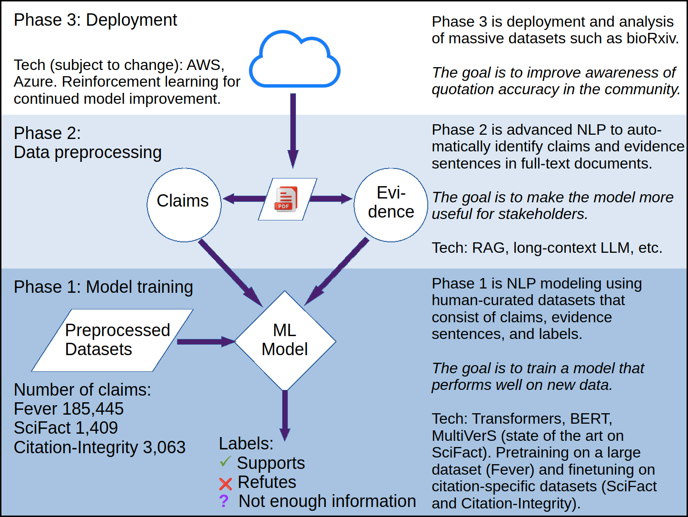

# ReadyCite

Quotation errors are unfortunately common in the scientific literature ([Jergas and Baethge, 2015](https://doi.org/10.7717/peerj.1364); [Mogull, 2017](https://doi.org/10.1371/journal.pone.0184727)). This type of error occurs when a claim is not supported by the provided citation. The standard advice to avoid quotation errors is: “*Read before you cite*” ([Steel, 1996](https://doi.org/10.1016/S0140-6736\(05\)66108-9); [Simkin and Roychowdhury, 2003](https://www.complex-systems.com/issues/14-3/)).

Human judgment is essential to prevent quotation errors. At the same time, automatic detection of quotation errors would help writers, reviewers, and editors to improve the quality of scientific publications.

The aim of this project is to build a machine learning system that identifies quotation errors in a source text. Given a manuscript together with the text of the cited references, the algorithm will produce a list of claims (i.e., sentences with a citation) and a prediction of whether each claim is adequately supported by the citation.

The unique features of this project are:
- Data variety: Training on multiple publicly available datasets.
- Data preprocessing: Not only *claim verification* using evidence sentences or abstracts from references, but also *evidence retrieval* to retrieve evidence sentences from full-text references.
- Large scale: The system will be built to process massive datasets.

## Scope of the project

The problem starts relatively simple, with claims and abstracts or evidence sentences that are used for *claim verification*. Abstracts are available in the **SciFact** corpus and evidence sentences are available in the **Citation-Integrity** corpus.

There are two reasons why we can't stop there:
1. Using abstracts for claim verification is problematic. The authors of **SciFact** note that "evidence is found in the abstract in more than 60% of cases" ([Wadden et al., 2020](https://doi.org/10.18653/v1/2020.emnlp-main.609)), but this implies that evidence for many claims is not in the abstract. Likewise, [Lang (2023)](https://doi.org/10.3897/ese.2023.e94153) advises that “errors can come from citing [...] abstracts,  which often contain information different from that in the associated article.”
2. Hand-picked lists of evidence sentences, which are available in **Citation-Integrity**, require considerable human effort.

Therefore, this project is planned to have three phases:

- Phase 1: Model training using datasets with abstracts or hand-picked evidence sentences from references.
- Phase 2: Setting up a preprocessing pipeline for evidence retrieval from full-text references.
- Phase 3: Deployment and processing of massive datasets, such as bioRxiv.

## Training data

The [**Fever** dataset](https://fever.ai/dataset/fever.html) with 185,445 claims derived from Wikipedia will be used for pretraining a claim verification model. Then, the following two datasets targeting quotation accuracy will be used to finetune the model. 

[Wadden et al. (2020)](https://doi.org/10.18653/v1/2020.emnlp-main.609): “The **SciFact** dataset consists of 1,409 scientific claims verified against a corpus of 5,183 abstracts.” The claims were written by experts, paired with abstracts, and annotated with labels and rationales.

[Sarol et al. (2024)](https://doi.org/10.1093/bioinformatics/btae420): **Citation-Integrity** is a corpus based on citations to 100 highly-cited biomedical publications with full text available from the PubMed Central Open Access Subset. Citing articles were randomly selected from those that cite the reference article multiple times. According to the authors, “A total of 3063 citation instances corresponding 3420 citation context sentences and 3791 evidence sentences were annotated”.

Although there is some overlap with the datasets used for the MultiVerS model described by [Wadden et al. (2022)](https://doi.org/10.18653/v1/2022.findings-naacl.6), this addition of the **Citation-Integrity** dataset improves the representation of quotation accuracy in this data collection.

See [data/README.md](data/README.md) for source URLs and other information.

## Glossary

- Reference error - broad class that includes quotation errors and citation errors. The definitions given below are derived from other authors (e.g. [Eichorn and Yankauer, 1987](https://doi.org/10.2105/AJPH.77.8.1011); [Smith and Cumberledge, 2020](https://doi.org/10.1098/rspa.2020.0538); [Lang, 2023](https://doi.org/10.3897/ese.2023.e94153)).
	- Quotation error - a reference error in which the content of the cited reference does not support the claim made by the authors, or there is some other inconsistency between the authors' proposition and the cited reference. **Detecting this type of error is the goal of this project.**
	- Citation error - a reference error in which the reference text has incorrect bibliographic information (e.g., formatting or typographical errors).
- Citation instance - a single instance of a citation in a citing article (Sarol et al., 2024).
- Citation sentence (syn. citance) - the sentence containing a citation (Sarol et al., 2024).
- Reference article - the article being cited (Sarol et al., 2024).
- Quotation accuracy - A label that describes whether a citation supports a claim. **The model will be trained on datasets with these labels.** Examples of labels include Support, Refute, or Neutral (Not Enough Information) (Wadden et al., 2020; Sarol et al., 2024).

## Keywords

Quotation accuracy, Quotation error, Citation accuracy, Citation bias, Citation distortion, Citation integrity, Misattribution, Miscitation

## History

The content above was formerly the README.md for the project (Nov. 26 - Dec. 10, 2024).
The new README.md was created with Claude Haiku (Explanatory style) using the following prompt:

> Please compose a README.md for the GitHub repository for the ReadyCite project. Include an appealing but accurate heading and a concise description of the project's features. Include other sections (e.g. data, roadmap, frameworks) at your discretion. Use emojis to enhance keywords and section headings. Refer to the attached files for details. Attached Files: `00_Motivation-Scope-Data.md`,  `01_Project-Proposal.md`, and `02_Reproduction-of-Citation-Integrity.ipynb`

